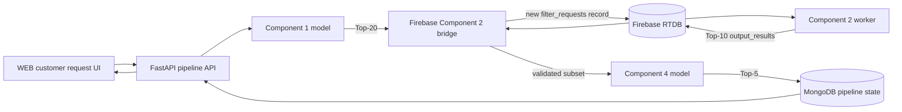

# Component 1 → Component 2 → Component 4 WEB Integration Plan

## Implementation status (2026-08-08)

The decision-complete design in this document is now implemented on
`fn/new-branch/nadee` with these executable entry points:

- FastAPI: `scripts/windows/start-fastapi.ps1`
- Single Mongo-leased worker: `scripts/windows/start-pipeline-worker.ps1`
- WEB: `scripts/windows/start-web.ps1`
- Collision-safe provider import: `packages/backend/scripts/import_pipeline_providers.py`
- Firebase RTDB rules: `database.rules.json`, referenced by `firebase.json`

The runtime path is strictly C1 Top-20 → Firebase-compatible C2 Top-0–10 → C4
Top-5. A zero C2 result remains stored as zero and invokes the labeled
`component2_zero_fallback` using C1 ranks 1–10. Component 3 and `daily_demand`
remain outside this path.

### Research import commands

Run from `packages/backend` after configuring `.env` and taking an external
project backup:

```powershell
.\.venv\Scripts\python.exe scripts\import_pipeline_providers.py `
  --dry-run `
  --report ..\..\docs\integration\evidence\research-provider-import.json

.\.venv\Scripts\python.exe scripts\import_pipeline_providers.py `
  --apply `
  --backup-dir C:\tmp\weda-research-provider-backup `
  --report ..\..\docs\integration\evidence\research-provider-import.json

.\.venv\Scripts\python.exe scripts\import_pipeline_providers.py `
  --verify-only `
  --report ..\..\docs\integration\evidence\research-provider-verification.json
```

`--apply` requires `RESEARCH_PROVIDER_PASSWORD=Weda@1234`. Reports explicitly
exclude the plaintext password. The importer refuses to write if any target
Mongo user/provider, Firebase UID/email, or RTDB provider key already exists;
`--resume` is accepted only with a stage report produced by the same import.

### Local startup and acceptance

1. Configure `packages/backend/.env` and `WEB/.env` from their examples.
2. Run the artifact checker and the three launch scripts in separate terminals.
3. Sign in as a linked customer, submit a request within the seven-day forecast,
   and inspect the persisted progress and Top-5.
4. Sign in as the selected provider to complete or cancel the booking.
5. Rate a completed booking as the owning customer and confirm it appears in a
   later C1 preference history and C4 platform evidence.
6. As admin, open Pipeline Audit and verify counts, versions, fallback, and errors.

Automated verification covers the existing backend suite plus C2 contract,
zero-fallback, import-population tests, and the production WEB build.

## 1. Objective

Implement the complete customer recommendation flow in the new `WEB` application while
running the three ML components strictly in this order:

```text
Customer request
    → Component 1: hybrid recommendation, Top-20
    → Component 2: location, availability, time, and weather filtering, Top-10
    → Component 4: trust, review credibility, and CATF ranking, Top-5
    → Customer-facing final results
```

Component 1 and Component 4 may be changed to integrate correctly with Component 2.
Component 2's existing Firebase attributes and filtering behavior must remain compatible.
Additional Firebase attributes and nodes may be introduced, but existing Component 2
attributes must not be deleted, renamed, or given a different meaning.

This plan also covers:

- The missing customer request and recommendation frontend.
- Provider identity alignment across MongoDB and Firebase.
- Repeatable MongoDB/Firebase data import and verification.
- Pipeline state, failure recovery, testing, and deployment.

## 2. Current Project Findings

### 2.1 Source layout

The current `fn/new-branch/nadee` checkout does not contain the complete new WEB source or
the full Component 4 implementation. The complete versions currently exist on the
`integration/web-fastapi-nondestructive` branch.

The untracked `ML Filter/` directory contains Component 2 assets:

- `filtering.ipynb`: Firebase listener and provider filtering logic.
- `demand_model.ipynb`: demand prediction training.
- `firebase_demand_sync.ipynb`: demand prediction Firebase sync.
- `sync_firebase_demand.py`: demand forecast automation.
- Model artifacts, result CSVs, plots, and Firebase fixtures.

Implementation must begin by establishing a branch containing both:

1. The complete WEB/FastAPI/Component 1/Component 4 integration baseline.
2. A reviewed and sanitized copy of the Component 2 runtime assets.

### 2.2 Existing Component 1 contract

Component 1 accepts a canonical MongoDB request ID and enforces `top_k = 20`.

Its response already provides:

- `request_id`
- `user_id`
- `component_version`
- `model_version`
- Provider metadata
- `tfidf_score`
- `bert_score`
- `cf_score`
- `hybrid_score`

### 2.3 Existing Component 2 contract

Component 2 polls Firebase `filter_requests` for records with:

```json
{
  "request_id": "...",
  "user_id": "...",
  "location_type": "indoor",
  "service_date": "2026-08-10",
  "service_time": {
    "start_time": "10:00 AM",
    "end_time": "12:00 PM"
  },
  "isNewRequest": true,
  "results": {
    "provider_ids": []
  }
}
```

It reads providers from `providers/{provider_id}`, filters by location and working hours,
adds weather analysis, selects at most ten providers, writes `output_results`, and changes
`isNewRequest` to `false`.

### 2.4 Existing Component 4 contract

Component 4 already accepts at most ten unique canonical `P...` IDs from Component 2 and
returns at most five providers. It validates authenticated customer ownership and persists
its ranking runs in MongoDB.

### 2.5 Missing frontend

The new WEB application currently supports registration, authentication, profiles,
provider browsing, administration, demand views, and Component 2 history. It does not yet
provide a complete customer service-request form or a live Component 1 → 2 → 4 result flow.

## 3. Recommended Architecture

FastAPI should be the durable pipeline orchestrator. Firebase remains the Component 2
transport and runtime database. The browser must not directly coordinate the ML components.



The recommended API is asynchronous:

1. `POST /api/v1/pipeline/runs` returns `202 Accepted` and a `run_id`.
2. A backend worker executes and monitors the pipeline.
3. `GET /api/v1/pipeline/runs/{run_id}` returns progress or final results.
4. The frontend polls the status endpoint until the run completes or fails.

This is safer than keeping one HTTP request open while Component 2 polls Firebase.

## 4. Non-Negotiable Pipeline Invariants

1. The execution order is always Component 1 → Component 2 → Component 4.
2. Component 2 never receives a provider outside Component 1's Top-20.
3. Component 2 returns no more than ten unique providers.
4. Every Component 2 provider must be a member of the matching Component 1 result.
5. Component 4 receives only Component 2 output.
6. Component 4 returns no more than five providers.
7. Every Component 4 provider must be a member of the Component 2 output.
8. `request_id` and canonical `provider_id` never change between components.
9. All scores crossing a component boundary use a documented range.
10. Empty, timed-out, invalid, or unknown-provider results fail explicitly; random provider
    selection is not allowed.

## 5. Firebase Compatibility Policy

The following existing Component 2 attributes must retain their current names and meaning:

- `filter_requests/{id}/request_id`
- `filter_requests/{id}/user_id`
- `filter_requests/{id}/location_type`
- `filter_requests/{id}/service_date`
- `filter_requests/{id}/service_time.start_time`
- `filter_requests/{id}/service_time.end_time`
- `filter_requests/{id}/isNewRequest`
- `filter_requests/{id}/results.provider_ids`
- `filter_requests/{id}/output_results.provider_ids`
- `filter_requests/{id}/output_results.evaluated_providers`
- `filter_requests/{id}/output_results.weather_risk`
- `filter_requests/{id}/output_results.recommendation`
- `filter_requests/{id}/output_results.weather_summary`
- `filter_requests/{id}/output_results.evaluated_at`

Existing `daily_demand`, `customers`, `providers`, and historical `filter_requests` records
must not be deleted or replaced.

Additional attributes may be added under new nested namespaces so Component 2 ignores them:

```json
{
  "pipeline": {
    "run_id": "PIPE...",
    "schema_version": "pipeline-handoff-v1",
    "created_at": "...",
    "component1": {
      "component_version": "...",
      "model_version": "...",
      "output_count": 20
    },
    "component2": {
      "component_version": "firebase-filter-v1",
      "model_version": "distance-hours-weather-v1"
    },
    "status": "waiting_for_component2"
  }
}
```

Component 2 continues to read and write its original attributes. The backend may read the
additive `pipeline` metadata for lineage, but Component 2 must not depend on it.

## 6. Canonical Handoff Contracts

### 6.1 Customer request → Component 1

```json
{
  "request_id": "R123ABC",
  "query": "Need an electrician for a wiring repair",
  "category": "Electricians",
  "district": "Colombo",
  "city": "Moratuwa",
  "min_rating": 0,
  "top_k": 20
}
```

The canonical service request stored in MongoDB also contains:

- `user_id`
- `urgency`
- `created_at`
- Requested service date and time, either directly on the request or in a linked pipeline
  request record.

### 6.2 Component 1 → Component 2

Component 1 produces exactly 20 when at least 20 eligible providers are available:

```json
{
  "component_version": "component1-v1",
  "model_version": "hybrid-model-v1",
  "request_id": "R123ABC",
  "user_id": "U123ABC",
  "results": [
    {
      "provider_id": "P00001",
      "provider_name": "Provider One",
      "category": "Electricians",
      "district": "Colombo",
      "city": "Moratuwa",
      "skills": "Wiring, Repairs",
      "description": "...",
      "experience_years": 5,
      "rating": 4.5,
      "review_count": 20,
      "booking_success_rate": 0.9,
      "interaction_count": 50,
      "tfidf_score": 0.8,
      "bert_score": 0.9,
      "cf_score": 0.7,
      "hybrid_score": 0.84
    }
  ]
}
```

The Firebase bridge writes the provider IDs into the existing Component 2 field:

```json
{
  "request_id": "R123ABC",
  "user_id": "firebase-customer-uid",
  "location_type": "indoor",
  "service_date": "2026-08-10",
  "service_time": {
    "start_time": "10:00 AM",
    "end_time": "12:00 PM"
  },
  "isNewRequest": true,
  "results": {
    "provider_ids": ["P00001", "P00002"]
  },
  "pipeline": {
    "run_id": "PIPE123",
    "schema_version": "pipeline-handoff-v1",
    "component1": {
      "component_version": "component1-v1",
      "model_version": "hybrid-model-v1",
      "output_count": 20
    }
  }
}
```

Full Component 1 scores remain in MongoDB. Firebase receives only the IDs Component 2 needs
plus optional lineage metadata.

### 6.3 Component 2 → Component 4

Component 2 retains its current output shape:

```json
{
  "isNewRequest": false,
  "output_results": {
    "provider_ids": ["P00001", "P00002"],
    "evaluated_providers": [],
    "weather_risk": "LOW_RISK",
    "recommendation": "...",
    "weather_summary": "...",
    "evaluated_at": "..."
  }
}
```

The bridge validates that these IDs form a subset of Component 1's Top-20 and constructs:

```json
{
  "source": "component2",
  "request_id": "R123ABC",
  "user_id": "U123ABC",
  "component_version": "firebase-filter-v1",
  "model_version": "distance-hours-weather-v1",
  "provider_ids": ["P00001", "P00002"],
  "top_k": 5
}
```

Component 4 may be changed to preserve the complete Component 2 contextual data in its
MongoDB run document, but its ranking candidates must still come only from `provider_ids`.

### 6.4 Component 4 → WEB

The final response contains:

- Final Top-5 providers.
- Final score and rank.
- Aspect scores.
- Review credibility and reliability.
- Evidence status and score source.
- Provider profile metadata.
- Component/model versions.
- Component 2 distance, availability, and weather context joined by `provider_id`.

## 7. Implementation Phases

### Phase 0 — Establish the integration baseline

1. Preserve the current untracked `ML Filter/` directory.
2. Merge or rebase the integration work onto the branch containing the complete WEB and
   Component 4 implementation.
3. Copy the required Component 2 runtime code and artifacts into reviewed repository paths.
4. Exclude generated plots, caches, local outputs, and credentials where appropriate.
5. Add repository documentation describing how to run each service.
6. Run the existing WEB build and backend tests before changing behavior.

Acceptance criteria:

- The complete `WEB/src` tree is present.
- Component 1 and Component 4 health checks pass.
- Component 2 can connect to a Firebase emulator or controlled test database.
- No secrets are tracked by Git.

### Phase 1 — Secure Firebase configuration

1. Remove the Firebase Admin SDK JSON file from the project working tree used for commits.
2. Rotate the service-account key if it has been committed, uploaded, or shared.
3. Configure credentials through environment variables:

```env
FIREBASE_SERVICE_ACCOUNT_PATH=C:\secure\service-account.json
FIREBASE_DATABASE_URL=https://service-e333a-default-rtdb.firebaseio.com
```

4. Add startup validation that refuses to run against production Firebase without an
   explicit environment setting.
5. Separate emulator, development, and production database URLs.

### Phase 2 — Freeze and test Component 2 compatibility

1. Capture a fresh Firebase export.
2. Record hashes for all existing Component 2 records and fields.
3. Define Pydantic models for the existing Component 2 input and output shapes.
4. Add tests proving the new models accept the current live Firebase records.
5. Add tests proving additional `pipeline` attributes do not affect Component 2 parsing.
6. Do not rename or normalize Component 2's camelCase fields inside Firebase.

### Phase 3 — Unify customer and provider identities

There are currently two identity formats:

- Firebase Auth UID used by Component 2 to find customer location.
- Canonical Mongo IDs such as `U...` and `P...` required by Components 1 and 4.

Create durable mappings:

```text
Firebase customer UID ↔ Mongo user_id/customer_id
Firebase provider key ↔ canonical Mongo provider_id
```

Rules:

1. Component 2 receives the Firebase customer UID in its unchanged `user_id` field.
2. Component 4 receives the canonical Mongo `U...` ID.
3. Component 1, Component 2, and Component 4 use the same canonical `P...` provider IDs.
4. Runtime matching by display name or email is forbidden.
5. The pipeline fails before Component 1 if the authenticated account has no safe identity
   mapping.

### Phase 4 — Implement the provider data import mechanism

Component 2 can filter a Component 1 result only when Firebase contains a matching
`providers/{canonical_provider_id}` record with location and working hours. Therefore the
pipeline needs a shared provider population.

Create:

```text
packages/backend/scripts/import_pipeline_providers.py
```

Inputs:

- Component 1 provider dataset.
- Component 4 provider ID map and scores.
- Existing MongoDB providers.
- Existing Firebase providers.
- Sri Lankan city/district coordinates.
- A development-only default working-hours profile.

Import the intersection of Component 1 and Component 4 provider IDs. Prefer real provider
location and availability data. When development data is required, clearly label derived
coordinates and default hours.

Each Firebase record must keep Component 2's required shape:

```json
{
  "id": "P00001",
  "fullName": "Provider One",
  "category": "Electricians",
  "district": "Colombo",
  "city": "Moratuwa",
  "location": {
    "latitude": 6.773,
    "longitude": 79.8816
  },
  "workingHours": {
    "Monday": {
      "isOpen": true,
      "start": "08:00 AM",
      "end": "06:00 PM"
    }
  },
  "skills": ["Wiring"],
  "description": "...",
  "verified": false,
  "pipelineSeed": {
    "version": "pipeline-provider-seed-v1",
    "locationSource": "city-centroid",
    "workingHoursSource": "development-default"
  }
}
```

The importer must support:

- `--dry-run`
- `--apply`
- `--verify-only`
- `--resume`
- `--report`
- `--limit`
- `--category`
- Source and destination backup paths.

Safety requirements:

1. Insert only missing provider IDs.
2. Never overwrite existing Firebase provider records by default.
3. Reject value conflicts and ID collisions.
4. Use ETag-protected conditional writes.
5. Back up Firebase and MongoDB before applying.
6. Verify every imported provider is available to Components 1, 2, and 4.
7. Never copy password hashes, tokens, private documents, or authentication secrets.
8. Produce counts, hashes, inserted IDs, unchanged IDs, conflicts, and verification results.

### Phase 5 — Convert Component 2 into a repeatable worker

Extract the filtering runtime from `ML Filter/filtering.ipynb` into:

```text
ML Filter/component2_worker.py
```

Do not change the established filtering behavior during the first integration.

The worker must:

1. Poll `filter_requests` for `isNewRequest == true`.
2. Safely claim one request to avoid duplicate processing.
3. Read Component 1 IDs from `results.provider_ids`.
4. Accept no more than 20 unique candidates.
5. Look up the existing Firebase customer by `user_id`.
6. Read matching Firebase providers by canonical ID.
7. Apply the existing distance, working-hours, requested-time, and weather filtering.
8. Sort eligible providers using the existing Component 2 algorithm.
9. Return at most ten providers.
10. Write the current `output_results` structure.
11. Set `isNewRequest` to `false` only after a successful output write.
12. Preserve input and failure information when processing fails.
13. Support one-request mode for tests:

```powershell
python component2_worker.py --once --request-id R123ABC
```

Recommended additive operational fields:

```json
{
  "pipeline": {
    "component2_started_at": "...",
    "component2_completed_at": "...",
    "attempt_count": 1,
    "worker_id": "...",
    "error": null
  }
}
```

### Phase 6 — Add MongoDB pipeline persistence

Create a `pipeline_runs` collection:

```json
{
  "run_id": "PIPE123",
  "request_id": "R123ABC",
  "mongo_user_id": "U123ABC",
  "firebase_user_id": "firebase-uid",
  "status": "waiting_for_component2",
  "component1": {
    "run_id": "C1RUN123",
    "provider_ids": ["P00001"],
    "component_version": "component1-v1",
    "model_version": "hybrid-model-v1"
  },
  "component2": {
    "firebase_path": "filter_requests/R123ABC",
    "provider_ids": [],
    "raw_output": null,
    "component_version": "firebase-filter-v1",
    "model_version": "distance-hours-weather-v1"
  },
  "component4": {
    "run_id": null,
    "provider_ids": []
  },
  "created_at": "...",
  "updated_at": "...",
  "error": null
}
```

State machine:

```text
created
→ component1_running
→ component1_completed
→ waiting_for_component2
→ component2_completed
→ component4_running
→ completed
```

Failure states:

```text
component1_failed
component2_timeout
component2_invalid_output
component4_failed
cancelled
```

Add indexes for unique `run_id`, unique active `request_id`, status, customer history, and
creation time.

### Phase 7 — Implement the Firebase Component 2 bridge

Create:

```text
packages/backend/app/integrations/firebase_component2.py
```

Responsibilities:

1. Create a new `filter_requests/{request_id}` record.
2. Write the existing Component 2 input attributes unchanged.
3. Add optional `pipeline` lineage metadata.
4. Refuse to overwrite an existing record with different content.
5. Poll or subscribe until `isNewRequest == false` and `output_results` exists.
6. Validate output IDs are unique and number between one and ten.
7. Validate output IDs are a subset of the saved Component 1 Top-20.
8. Preserve Component 2 contextual output in MongoDB.
9. Map the authenticated Firebase UID back to the canonical Mongo user before Component 4.
10. Apply a configurable timeout and retry policy.

### Phase 8 — Adjust Component 1 for pipeline eligibility

Component 1 must not return providers that Component 2 cannot resolve.

Add pipeline eligibility filtering before final Top-20 selection:

1. Provider exists in the canonical import inventory.
2. Provider exists in Firebase under the same `P...` ID.
3. Provider has valid coordinates.
4. Provider has a Component 2-compatible working-hours object.
5. Provider is known by Component 4 or is supported by its documented category-prior
   fallback.

Do not run Component 2 before Component 1. Do not let Component 2 choose candidates from all
Firebase providers when Component 1 returns fewer or invalid IDs.

Component 1 must persist:

- Full Top-20 order.
- All four scores.
- Eligibility exclusions and reasons.
- Component/model versions.
- Processing time.

If fewer than 20 eligible providers exist, return the available count and record an explicit
`insufficient_candidates` condition. Do not fill the list randomly.

### Phase 9 — Adjust Component 4 for the Component 2 handoff

Component 4 must accept only the validated Component 2 provider IDs.

Required changes:

1. Preserve the current `source: component2` enforcement.
2. Store Component 2 model/version identifiers.
3. Store the complete raw Component 2 output or a privacy-safe snapshot.
4. Join distance, availability, working-hours status, and weather context to each final
   provider by canonical `provider_id`.
5. Reject providers not present in Component 2 output.
6. Keep `top_k <= 5`.
7. Never fall back to random candidates.
8. Return enough provider metadata for the WEB final-result cards.
9. Continue using category priors only as the documented credibility fallback for a known
   candidate, never as a way to introduce another provider.

### Phase 10 — Implement the backend orchestrator

Add:

```text
packages/backend/app/pipeline/orchestrator.py
packages/backend/app/pipeline/schemas.py
packages/backend/app/pipeline/worker.py
packages/backend/app/api/pipeline.py
```

Endpoints:

```http
POST /api/v1/pipeline/runs
GET  /api/v1/pipeline/runs/{run_id}
POST /api/v1/pipeline/runs/{run_id}/retry
GET  /api/v1/pipeline/runs/{run_id}/events
```

Start request:

```json
{
  "request_text": "Need an electrician for a wiring repair",
  "category": "Electricians",
  "district": "Colombo",
  "city": "Moratuwa",
  "urgency": "normal",
  "service_date": "2026-08-10",
  "service_time": {
    "start_time": "10:00 AM",
    "end_time": "12:00 PM"
  },
  "location_type": "indoor"
}
```

Execution steps:

1. Authenticate the customer.
2. Resolve both Mongo and Firebase identities.
3. Validate the requested date/time and customer location.
4. Create the MongoDB service request and pipeline run.
5. Run Component 1 with fixed Top-20.
6. Persist the complete Component 1 result.
7. Write a new Firebase Component 2 request.
8. Mark the pipeline `waiting_for_component2`.
9. Read and validate Component 2 output.
10. Mark the pipeline `component2_completed`.
11. Run Component 4 with only the validated Component 2 IDs.
12. Persist the Component 4 result.
13. Mark the pipeline `completed`.
14. Return the combined final response to the WEB application.

The orchestrator should call Component 1 and Component 4 application services directly,
not make loopback HTTP calls to its own API.

### Phase 11 — Implement the missing WEB frontend

Add a dedicated customer workflow rather than replacing the existing provider directory.

Recommended files:

```text
WEB/src/features/service-request/ServiceRequestForm.tsx
WEB/src/features/recommendation/PipelineProgress.tsx
WEB/src/features/recommendation/FinalProviderResults.tsx
WEB/src/features/recommendation/RecommendationDetails.tsx
WEB/src/services/pipeline-service.ts
WEB/src/types/pipeline.ts
```

#### Customer request form

Fields:

- Problem description.
- Service category.
- District and city.
- Urgency.
- Service date.
- Start time and end time.
- Indoor, outdoor, or indoor-and-outdoor location type.
- Customer location confirmation/map.

Validation:

- Description length.
- Future/allowed service date.
- End time after start time.
- Valid category.
- Customer location present.
- Authenticated and linked customer account.

#### Pipeline progress interface

Display real backend state:

```text
1. Finding relevant providers — Component 1
2. Checking distance, availability and weather — Component 2
3. Evaluating trust and review credibility — Component 4
4. Final Top-5 ready
```

Do not fake progress timers. Poll the pipeline status endpoint and render the persisted state.

#### Final Top-5 interface

Each provider card should show:

- Final rank.
- Provider name, image, category, district, and city.
- Skills and experience.
- Component 1 relevance/hybrid score.
- Component 2 distance, availability, and weather result.
- Component 4 final trust score.
- Aspect scores.
- Credibility/reliability information.
- Evidence status.
- View profile action.
- Select/request booking action.

Only final Component 4 providers should be selectable for booking. Component 1 Top-20 and
Component 2 Top-10 may be shown in an optional expandable “How recommendations were
filtered” section.

#### History and recovery interface

Add:

- Customer pipeline history.
- Pending-run recovery after page refresh.
- Retry button for permitted failure states.
- Clear timeout, validation, authentication, and model-unavailable messages.
- Admin pipeline audit view with component counts and versions.

#### API integration

Extend `WEB/src/config/api.ts` with typed pipeline calls and place orchestration-specific
logic in `WEB/src/services/pipeline-service.ts`.

The browser must communicate only with FastAPI for starting and tracking a pipeline. It must
not write directly to Firebase `filter_requests`.

### Phase 12 — Authentication mode

The full pipeline requires a FastAPI-authenticated customer because Components 1 and 4
enforce MongoDB request ownership.

Recommended transition configuration:

```env
VITE_DATA_SOURCE=hybrid
VITE_AUTH_SOURCE=firebase-link
VITE_FILE_STORAGE_SOURCE=firebase
```

After all dashboards have complete backend contracts, move to FastAPI as the primary data
and authentication source while keeping Firebase only for Component 2 and any intentionally
retained Firebase features.

### Phase 13 — Testing strategy

#### Unit tests

1. Component 1 result → Firebase Component 2 request mapping.
2. Firebase Component 2 output → Component 4 request mapping.
3. Firebase UID ↔ Mongo user mapping.
4. Canonical provider mapping.
5. Duplicate provider rejection.
6. Component 2 non-subset rejection.
7. More than 20 Component 1 candidates rejected.
8. More than ten Component 2 candidates rejected.
9. More than five Component 4 outputs rejected.
10. Missing provider location or hours.
11. Component 2 timeout and retry.
12. Unknown provider in Component 4.
13. No random fallback behavior.

#### Firebase emulator tests

1. Import a frozen Firebase fixture.
2. Hash all existing Component 2 attributes and records.
3. Add pipeline provider records.
4. Create a new pipeline request.
5. Run Component 2 once.
6. Verify existing Component 2 attributes retain their values and types.
7. Verify only the new request and explicitly additive attributes changed.
8. Verify Component 2 outputs no more than ten Component 1 candidates.

#### Backend integration tests

1. Start an authenticated customer pipeline.
2. Verify Component 1 persistence.
3. Verify Firebase handoff.
4. Supply a valid Component 2 output.
5. Verify Component 4 persistence and final response.
6. Restart the worker during `waiting_for_component2` and verify recovery.

#### Frontend tests

1. Request-form validation.
2. Pipeline progress states.
3. Page refresh recovery.
4. Failure and retry states.
5. Final Top-5 rendering.
6. Provider selection restricted to Component 4 output.

#### End-to-end acceptance test

```text
Customer submits one request
→ Component 1 returns Top-20
→ Firebase receives the same 20 IDs
→ Component 2 returns a subset of at most 10
→ Component 4 returns a subset of at most 5
→ WEB displays the final Top-5
```

### Phase 14 — Deployment sequence

1. Establish the complete integration branch baseline.
2. Secure Firebase credentials.
3. Create backups and baseline hashes.
4. Deploy MongoDB indexes and pipeline persistence.
5. Dry-run the provider importer.
6. Review import counts and collisions.
7. Apply and verify the additive provider import.
8. Deploy the Component 2 worker without changing its Firebase contract.
9. Deploy the Firebase Component 2 bridge.
10. Deploy Component 1 eligibility changes.
11. Deploy Component 4 handoff changes.
12. Deploy the pipeline orchestrator and worker.
13. Deploy the WEB request and recommendation UI.
14. Run one controlled end-to-end UAT request.
15. Verify protected Firebase hashes and all subset invariants.
16. Enable the flow for normal users.

## 8. Rollback Strategy

1. Disable new pipeline submissions through a feature flag.
2. Stop the pipeline worker and Component 2 worker.
3. Leave historical `filter_requests` records intact.
4. Remove only records carrying the exact new import/pipeline version after reviewing a
   generated deletion plan.
5. Restore MongoDB pipeline collections from backup if required.
6. Revert the WEB feature flag to the provider-directory-only experience.
7. Never perform a root-level Firebase restore unless a verified disaster-recovery process
   requires it.

## 9. Definition of Done

The integration is complete only when:

- The ML models execute strictly in the order Component 1 → Component 2 → Component 4.
- Component 1 produces the Top-20 candidate set.
- Firebase receives those same canonical IDs in Component 2's current input structure.
- Component 2 returns at most ten providers from that Top-20.
- Component 4 receives only Component 2 output and returns at most five providers.
- The WEB application contains the full customer request, progress, history, error, and
  final-result experience.
- The customer can select providers only from Component 4's final output.
- Every run has complete identity, request, candidate, score, version, and timing lineage.
- Pipeline runs recover safely after process restarts.
- Provider and pipeline imports are repeatable, additive, conflict-aware, and verifiable.
- Existing Component 2 attributes remain compatible and are never deleted or renamed.
- Existing Firebase data outside explicitly additive paths is unchanged.
- Password hashes, tokens, private documents, and Firebase credentials are never copied or
  committed.

## 10. Recommended First Implementation Milestone

The lowest-risk first milestone is a development end-to-end vertical slice:

1. Integrate the complete WEB/Component 4 baseline.
2. Import at least 20 overlapping Component 1/Component 4 providers for one category into
   MongoDB and Firebase using canonical `P...` IDs.
3. Extract Component 2 into one-request worker mode without changing its calculations or
   Firebase field names.
4. Implement the pipeline state collection and Firebase bridge.
5. Implement one backend start/status flow.
6. Add one customer request form and final Top-5 page.
7. Run one complete request through Component 1 → 2 → 4.
8. Verify provider subset rules and existing Firebase hashes.

After this vertical slice passes, expand the importer to all supported categories, add
retry/recovery behavior, complete history/admin views, and perform production hardening.
